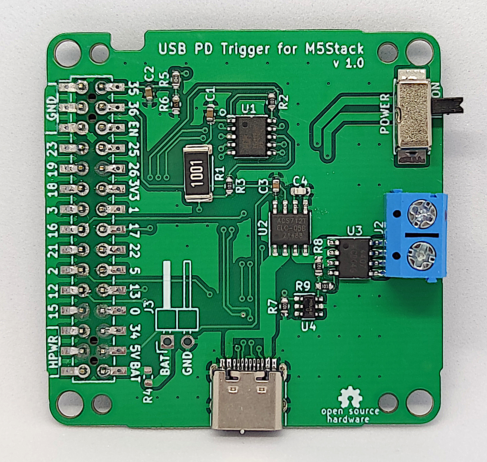

# PD Trigger Module for M5Stack

**[English Version](README_EN.md)**

## 概要

このモジュールは、USB PD（Power Delivery）プロトコルに対応した電源から電力を供給し、電流を監視・制御するためのM5Stack Core/Core2用の拡張モジュールです。
M-Busに接続することで、USB PD対応電源からの電力供給と電流監視を可能にします。

### プリント基板




## 主な機能

### USB PD対応充電器やモバイルバッテリーからの任意電圧の取り出し

WCH社のUSB PDシンクIC 「CH224K」を使用、M5Stack Basic/Core2のM-Busに接続して充電器のPDOに応じて「5V/9V/12V/15V/20V」が取り出せます。(注: PPSには未対応です。)

### 出力電流の測定

ALLEGRO社のホール電流センサIC「ACS712」を搭載し、出力電流が測定出来ます。

### 出力制御

Power Mos FETを用いて、M5Stackのプログラムから出力ON/OFFを制御できます。

### 回路図


## 使用している主要部品のデータシート

### USB PD Sink IC
[WCH CH224K](https://datasheet.lcsc.com/lcsc/2204251615_WCH-Jiangsu-Qin-Heng-CH224K_C970725.pdf)

### Hall Effect-Based Linear Current Sensor IC
[Allegro ACS712ELCTR-05B-T](https://datasheet.lcsc.com/lcsc/1811061527_Allegro-MicroSystems--LLC-ACS712ELCTR-05B-T_C44471.pdf)

### P-Channel MOSFET
[KEXIN AO4407](https://datasheet.lcsc.com/lcsc/1912111437_KEXIN-AO4407_C382328.pdf)

### Dual N-Channel MOSFET
[UMW AO6800](https://datasheet.lcsc.com/lcsc/2304120930_UMW-Youtai-Semiconductor-Co---Ltd--AO6800_C5375979.pdf)

## フォルダ構成

```text
M5_PDTrigger/
├── README.md              # プロジェクト説明
├── LICENSE                # MITライセンス
├── .gitignore            # Git除外ファイル
├── bom/                  # 部品表
│   └── M5_PDTrigger_BOM.csv
├── case/                 # 3Dプリント用ケース
│   └── PDtrigger_10mm_DC.stl
├── examples/             # サンプルコード
│   ├── M5_PDtrigger_test/
│   │   └── M5_PDtrigger_test.ino
│   └── M5Core2_PDtrigger_test/
│       └── M5Core2_PDtrigger_test.ino
├── image/                # 画像ファイル
│   ├── 01_top.jpg        # 基板表面
│   ├── 02_bottom.jpg     # 基板裏面
│   ├── 03_case_1.jpg     # ケース上面
│   ├── 04_case_2.jpg     # ケース下面
│   ├── 05_terminal.jpg   # 出力端子
│   ├── Sample_basic.jpg  # Basic動作例
│   ├── Sample_core2.jpg  # Core2動作例
│   ├── M5_PDTrigger_BOM.png
│   └── Schematics.png
└── schematics/           # 回路図
    └── M5PD_ch224k_sch.pdf
```

## サンプルコード

M5Stack Basic/Core用のサンプルコードです。以下の機能を実装しています：

### M5Stack Basic用サンプル

- **電圧切り替え**: ボタンA/Cで5V/9V/12V/15V/20VのPDOを切り替え
- **出力制御**: ボタンBで出力ON/OFFを制御  
- **電流電圧監視**: ACS712で電流を、ADコンバータで電圧を測定
- **PG監視**: Power Good信号の状態を表示

**ピン配置**:
```cpp
#define VBUS_I          35    // 電圧測定
#define VI_I            36    // 電流測定  
#define CFG1_O          16    // PD設定1
#define CFG2_O          17    // PD設定2
#define CFG3_O          13    // PD設定3
#define VBUSEN_O         2    // 出力イネーブル
#define PG_I            12    // Power Good入力
```

**操作方法**:
- ボタンA: PDO電圧を下げる
- ボタンB: 出力ON/OFF切り替え
- ボタンC: PDO電圧を上げる

### M5Stack Core2用サンプル

M5Stack Core2用のサンプルコードです。Basic版と同様の機能ですが、ピン配置が異なります：

**ピン配置**:
```cpp
#define VBUS_I          35    // 電圧測定
#define VI_I            36    // 電流測定
#define CFG1_O          13    // PD設定1  
#define CFG2_O          14    // PD設定2
#define CFG3_O          19    // PD設定3
#define VBUSEN_O        32    // 出力イネーブル
#define PG_I            27    // Power Good入力
```

**キャリブレーション**:

* 出力OFFの時に自動で0Aの補正を行います。
* ADコンバータのバラツキを補正するためのキャリブレーションパラメータがありますので、正確な値が必要な場合は実際の測定値を元に調整してください：

```cpp
float vScale = 7.83;     // 電圧スケール係数
float vi_0A = 2.44;      // 0A時の電流センサ出力電圧
float vi_2A = 2.85;      // 2A時の電流センサ出力電圧
```

## ケースに入れた状態


### 出力端子


## ライセンス

本プロジェクトはMITライセンスの下で公開されています。詳細はLICENSEファイルを参照してください。
