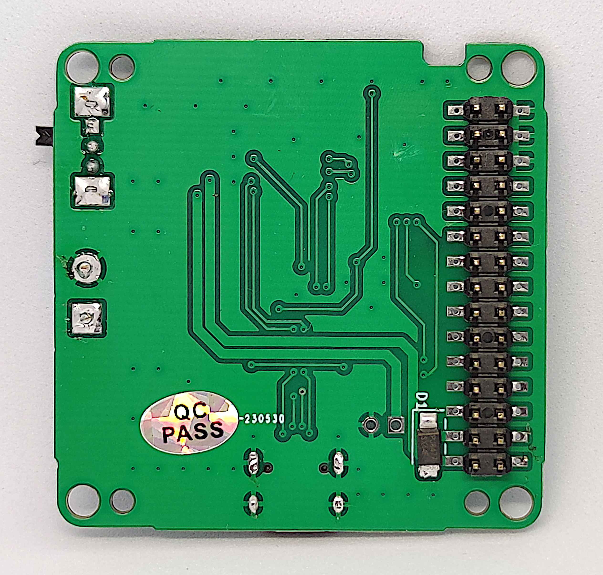
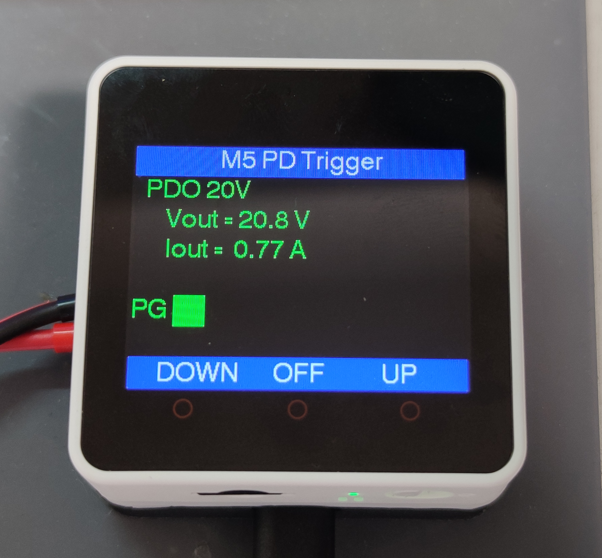

# PD Trigger Module for M5Stack

**[日本語版READMEはこちら](README.md)**

## Overview

This module is an expansion module for M5Stack Core/Core2 that supplies power from USB PD (Power Delivery) compatible power sources and monitors/controls current. By connecting to the M-Bus, it enables power supply and current monitoring from USB PD compatible power sources.

### PCB




## Main Features

### Variable Voltage Output from USB PD Compatible Chargers and Mobile Batteries

Uses WCH's USB PD sink IC "CH224K", connects to M5Stack Basic/Core2's M-Bus to output "5V/9V/12V/15V/20V" according to the charger's PDO. (Note: PPS is not supported.)

### Output Current Measurement

Equipped with Allegro's Hall effect current sensor IC "ACS712" to measure output current.

### Output Control

Power MOS FET enables output ON/OFF control from M5Stack programs.

### Schematic


## Datasheets of Main Components Used

### USB PD Sink IC
[WCH CH224K](https://datasheet.lcsc.com/lcsc/2204251615_WCH-Jiangsu-Qin-Heng-CH224K_C970725.pdf)

### Hall Effect-Based Linear Current Sensor IC
[Allegro ACS712ELCTR-05B-T](https://datasheet.lcsc.com/lcsc/1811061527_Allegro-MicroSystems--LLC-ACS712ELCTR-05B-T_C44471.pdf)

### P-Channel MOSFET
[KEXIN AO4407](https://datasheet.lcsc.com/lcsc/1912111437_KEXIN-AO4407_C382328.pdf)

### Dual N-Channel MOSFET
[UMW AO6800](https://datasheet.lcsc.com/lcsc/2304120930_UMW-Youtai-Semiconductor-Co---Ltd--AO6800_C5375979.pdf)

## Folder Structure

```text
M5_PDTrigger/
├── README.md              # Project description (Japanese)
├── README_EN.md           # Project description (English)
├── LICENSE                # MIT License
├── .gitignore            # Git ignore files
├── bom/                  # Bill of materials
│   └── M5_PDTrigger_BOM.csv
├── case/                 # 3D print case
│   └── PDtrigger_10mm_DC.stl
├── examples/             # Sample code
│   ├── M5_PDtrigger_test/
│   │   └── M5_PDtrigger_test.ino
│   └── M5Core2_PDtrigger_test/
│       └── M5Core2_PDtrigger_test.ino
├── image/                # Image files
│   ├── 01_top.jpg        # PCB top view
│   ├── 02_bottom.jpg     # PCB bottom view
│   ├── 03_case_1.jpg     # Case top view
│   ├── 04_case_2.jpg     # Case bottom view
│   ├── 05_terminal.jpg   # Output terminals
│   ├── Sample_basic.jpg  # Basic operation example
│   ├── Sample_core2.jpg  # Core2 operation example
│   ├── M5_PDTrigger_BOM.png
│   └── Schematics.png
└── schematics/           # Schematics
    └── M5PD_ch224k_sch.pdf
```

## Sample Code

Sample code for M5Stack Basic/Core. Implements the following features:

### M5Stack Basic Sample

- **Voltage Switching**: Switch 5V/9V/12V/15V/20V PDO with buttons A/C
- **Output Control**: Control output ON/OFF with button B
- **Current/Voltage Monitoring**: Measure current with ACS712, voltage with ADC
- **PG Monitoring**: Display Power Good signal status

**Pin Configuration**:
```cpp
#define VBUS_I          35    // Voltage measurement
#define VI_I            36    // Current measurement  
#define CFG1_O          16    // PD setting 1
#define CFG2_O          17    // PD setting 2
#define CFG3_O          13    // PD setting 3
#define VBUSEN_O         2    // Output enable
#define PG_I            12    // Power Good input
```

**Operation**:
- Button A: Decrease PDO voltage
- Button B: Toggle output ON/OFF
- Button C: Increase PDO voltage

**M5Stack Basic Operation Example**:


### M5Stack Core2 Sample

Sample code for M5Stack Core2. Same features as Basic version but with different pin configuration:

**Pin Configuration**:
```cpp
#define VBUS_I          35    // Voltage measurement
#define VI_I            36    // Current measurement
#define CFG1_O          13    // PD setting 1  
#define CFG2_O          14    // PD setting 2
#define CFG3_O          19    // PD setting 3
#define VBUSEN_O        32    // Output enable
#define PG_I            27    // Power Good input
```

**M5Stack Core2 Operation Example**:



**Calibration**:

* Automatic 0A correction is performed when output is OFF.
* Calibration parameters are available to compensate for ADC variations. Adjust based on actual measurements for accurate values:

```cpp
float vScale = 7.83;     // Voltage scale factor
float vi_0A = 2.44;      // Current sensor output voltage at 0A
float vi_2A = 2.85;      // Current sensor output voltage at 2A
```

## Module in Case


### Output Terminals


## License

This project is published under the MIT License. See the LICENSE file for details.
